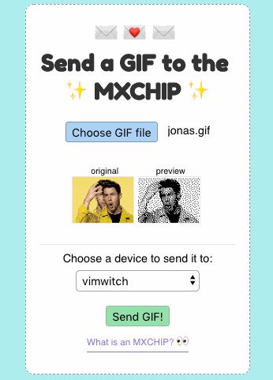
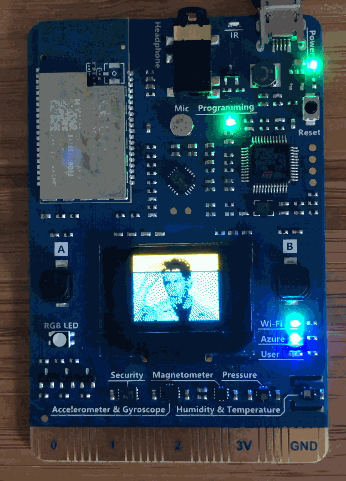

# mxchip-gifs

A website to upload GIFs to the MXCHIP



## How do I run this example application?

Great question - let's get started. Most importantly though - install [NodeJS](https://nodejs.org) (version 8 or higher is fine).

1. Create an IoT Hub and a new device identity
2. Set credentials on your MXCHIP
3. Upload code to your MXCHIP
4. Add IoT Hub connection string to your environment variables
5. Start the server!

### 1. Create an IoT Hub and a new device identity

We're going to use IoT Hub to communicate from our website to our MXCHIP device. Follow the docs guide on [how to create an IoT Hub](https://docs.microsoft.com/en-us/azure/iot-hub/quickstart-send-telemetry-node#create-an-iot-hub) and [how to create a new device identity](https://docs.microsoft.com/en-us/azure/iot-hub/quickstart-send-telemetry-node#register-a-device). Just follow those steps only and come back here. If you already have an IoT Hub to use, just create the device identity, and come back here when you're done. 

### 2. Set credentials on your MXCHIP

We'll need to store some credentials on your MXCHIP device so that it can connect to both IoT Hub and to your chosen WIFI.

1. Plug in your MXCHIP via USB to your computer
2. Open your favourite terminal with [screen](https://linuxize.com/post/how-to-use-linux-screen/) installed, or you can use [PuTTY](https://www.putty.org/).
3. Connect to your device via screen / PuTTY following the [MXCHIP documentation](https://microsoft.github.io/azure-iot-developer-kit/docs/use-configuration-mode/)
4. Use the `set_wifissid`, `set_wifipwd` commands to store your local wifi settings on the device. 
5. Use the `set_az_iothub` command with your device connection string you copied when you registered the device identity in an earlier step to store the device connection string on the device.
6. You're done! Next step.

### 3. Upload code to your MXCHIP

1. [Install Visual Studio Code](https://code.visualstudio.com/docs/setup/setup-overview) if you have not already.
2. [Setup your development environment for the MXCHIP following the guide](https://microsoft.github.io/azure-iot-developer-kit/docs/get-started/).
    > You could use the commands from Azure IoT Device Workbench to provision IoTHub as well as set your device connection string. Check the above guide for details.
3. Open *project.code-workspace* file from the repository's root directory in Visual Studio Code.
4. Hit Ctrl (or Cmd on OSX) + P to bring up the Command Pallette, then type **Arduino: Library Manager**, search for **ArduinoJson** and install version 5.13.5. Please do not install beta versions which contain breaking changes.
5. Hit Ctrl (or Cmd on OSX) + P again, and then type **Azure IoT Device Workbench**. Select the command of **Azure IoT Device Workbench: Update Device Code** to upload the device code to your MXCHIP. Ensure your MXCHIP is plugged in ^___^
6. The code should now be running on your device and waiting for a GIF! Onwards.

### 4. Add IoT Hub connection string to your environment variables

Our website needs to be able to see which devices are registered in your IoT Hub, and also to invoke device methods to control devices remotely. For this, we'll need a connection string for IoT Hub which has the right access policies.

1. [Create a new IoT Hub Access Policy](https://docs.microsoft.com/en-us/azure/iot-hub/iot-hub-devguide-security#access-control-and-permissions) with Service Connect, Registry Read, and Registry Write permissions. Name it 'mxchipgif' so that you remember what you created it for.
2. Copy the connection string for that policy.
3. Create a .env file under the repository's *server* folder in Visual Studio Code. Add the connection string value you copied in the previous step with the following format.

    ```dosini
    CONNECTION_STRING=your_connection_string
    ```

4. We're ready to run the server!

### 5. Start the server

1. Within this repository's folder on your computer, use your favourite terminal to run `cd server && npm install` 
2. Then, run `npm start` and navigate to localhost:3000 in your favourite browser
3. Try sending a GIF to your MXCHIP! ^___^

## Contributing

Contributions are welcomed! Please open a pull request or issue and detail as much as you can your ideas for improvement.

Check out the CONTRIBUTING.md file in this repository for details.
